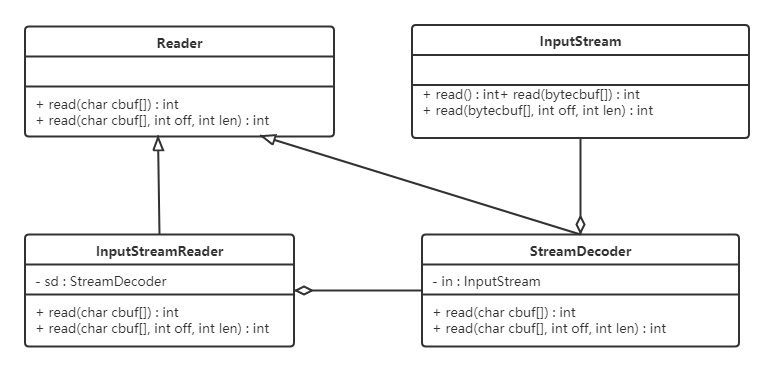
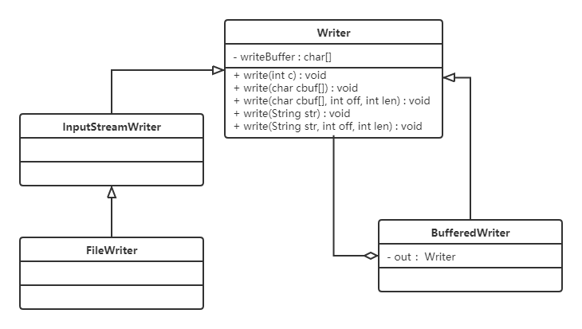
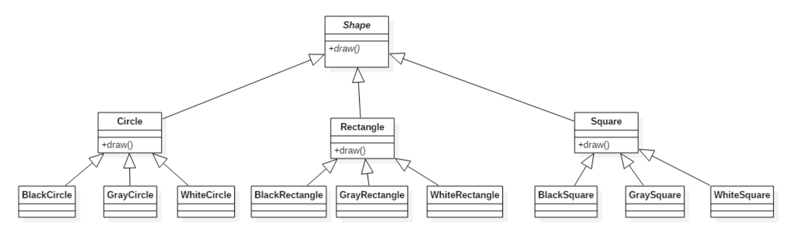
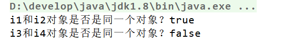
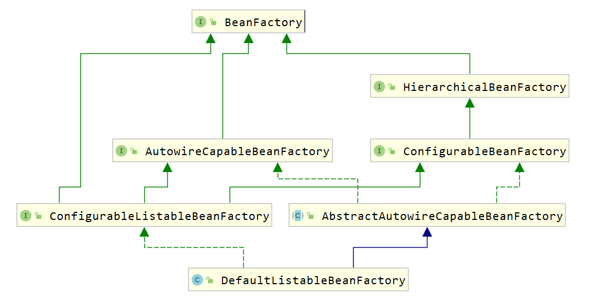

# 设计模式

‍

# 1. [软件设计原则](F:\idea-workspace\DesignPattern\design_patterns\src\main\java\com\panghu\principles)

**在软件开发中，为了提高软件系统的可维护性和可复用性，增加软件的可扩展性和灵活性，程序员要尽量根据6条原则来开发程序，从而提高软件开发效率、节约软件开发成本和维护成本。**

## 1.1 [开闭原则](F:\idea-workspace\DesignPattern\design_patterns\src\main\java\com\panghu\principles\openclose)

**对扩展开放，对修改关闭**。在程序需要进行拓展的时候，不能去修改原有的代码，实现一个热插拔的效果。简言之，是为了使程序的扩展性好，易于维护和升级。

**想要达到这样的效果，我们需要使用接口和抽象类。**

**因为抽象灵活性好，适应性广，只要抽象的合理，可以基本保持软件架构的稳定。而软件中易变的细节可以从抽象派生来的实现类来进行扩展，当软件需要发生变化时，只需要根据需求重新派生一个实现类来扩展就可以了。**

## 1.2 [里氏代换原则](F:\idea-workspace\DesignPattern\design_patterns\src\main\java\com\panghu\principles\liskovsub)

**里氏代换原则是面向对象设计的基本原则之一。**

**里氏代换原则：任何基类可以出现的地方，子类一定可以出现。通俗理解：子类可以扩展父类的功能，但不能改变父类原有的功能。换句话说，子类继承父类时，除添加新的方法完成新增功能外，尽量不要重写父类的方法。**

**如果通过重写父类的方法来完成新的功能，这样写起来虽然简单，但是整个继承体系的可复用性会比较差，特别是运用多态比较频繁时，程序运行出错的概率会非常大。**

## 1.3 [依赖倒转原则](F:\idea-workspace\DesignPattern\design_patterns\src\main\java\com\panghu\principles\dependinver)

**高层模块不应该依赖低层模块，两者都应该依赖其抽象；抽象不应该依赖细节，细节应该依赖抽象。简单的说就是要求对抽象进行编程，不要对实现进行编程，这样就降低了客户与实现模块间的耦合。**

## 1.4 [接口隔离原则](F:\idea-workspace\DesignPattern\design_patterns\src\main\java\com\panghu\principles\Interisolation)

**客户端不应该被迫依赖于它不使用的方法；一个类对另一个类的依赖应该建立在最小的接口上。**

**下面看一个例子来理解接口隔离原则**

## 1.5 [迪米特法则](F:\idea-workspace\DesignPattern\design_patterns\src\main\java\com\panghu\principles\demeter)

**迪米特法则又叫最少知识原则。**

**只和你的直接朋友交谈，不跟“陌生人”说话（Talk only to your immediate friends and not to strangers）。**

**其含义是：如果两个软件实体无须直接通信，那么就不应当发生直接的相互调用，可以通过第三方转发该调用。其目的是降低类之间的耦合度，提高模块的相对独立性。**

**迪米特法则中的“朋友”是指：当前对象本身、当前对象的成员对象、当前对象所创建的对象、当前对象的方法参数等，这些对象同当前对象存在关联、聚合或组合关系，可以直接访问这些对象的方法。**

## 1.6 合成复用原则

**合成复用原则是指：尽量先使用组合或者聚合等关联关系来实现，其次才考虑使用继承关系来实现。**

**通常类的复用分为继承复用和合成复用两种。**

**继承复用虽然有简单和易实现的优点，但它也存在以下缺点：**

1. **继承复用破坏了类的封装性。因为继承会将父类的实现细节暴露给子类，父类对子类是透明的，所以这种复用又称为“白箱”复用。**
2. **子类与父类的耦合度高。父类的实现的任何改变都会导致子类的实现发生变化，这不利于类的扩展与维护。**
3. **它限制了复用的灵活性。从父类继承而来的实现是静态的，在编译时已经定义，所以在运行时不可能发生变化。**

**采用组合或聚合复用时，可以将已有对象纳入新对象中，使之成为新对象的一部分，新对象可以调用已有对象的功能，它有以下优点：**

1. **它维持了类的封装性。因为成分对象的内部细节是新对象看不见的，所以这种复用又称为“黑箱”复用。**
2. **对象间的耦合度低。可以在类的成员位置声明抽象。**
3. **复用的灵活性高。这种复用可以在运行时动态进行，新对象可以动态地引用与成分对象类型相同的对象。**

# 2. 创建者模式

**创建型模式的主要关注点是“怎样创建对象？”，它的主要特点是“将对象的创建与使用分离”。**

**这样可以降低系统的耦合度，使用者不需要关注对象的创建细节。**

**创建型模式分为：**

* **单例模式**
* **工厂方法模式**
* **抽象工程模式**
* **原型模式**
* **建造者模式**

## 2.1 单例设计模式

**单例模式（Singleton Pattern）是 Java 中最简单的设计模式之一。这种类型的设计模式属于创建型模式，它提供了一种创建对象的最佳方式。**

**这种模式涉及到一个单一的类，该类负责创建自己的对象，同时确保只有单个对象被创建。这个类提供了一种访问其唯一的对象的方式，可以直接访问，不需要实例化该类的对象。**

### 2.1.1 单例模式的结构

**单例模式的主要有以下角色：**

* **单例类。只能创建一个实例的类**
* **访问类。使用单例类**

### 2.1.2 单例模式的实现

> **单例设计模式分类两种：**
>
> **饿汉式：类加载就会导致该单实例对象被创建**
>
> **懒汉式：类加载不会导致该单实例对象被创建，而是首次使用该对象时才会创建**

1. **饿汉式-方式1（静态变量方式）**

    ```
    /**
     * 饿汉式
     *      静态变量创建类的对象
     */
    public class Singleton {
        //私有构造方法
        private Singleton() {}

        //在成员位置创建该类的对象
        private static Singleton instance = new Singleton();

        //对外提供静态方法获取该对象
        public static Singleton getInstance() {
            return instance;
        }
    }
    ```

    说明：

    **	**该方式在成员位置声明Singleton类型的静态变量，并创建Singleton类的对象instance。instance对象是随着类的加载而创建的。如果该对象足够大的话，而一直没有使用就会造成内存的浪费。
2. **饿汉式-方式2（静态代码块方式）**

    ```
    /**
     * 恶汉式
     *      在静态代码块中创建该类对象
     */
    public class Singleton {

        //私有构造方法
        private Singleton() {}

        //在成员位置创建该类的对象
        private static Singleton instance;

        static {
            instance = new Singleton();
        }

        //对外提供静态方法获取该对象
        public static Singleton getInstance() {
            return instance;
        }
    }
    ```

    说明：

    **	**该方式在成员位置声明Singleton类型的静态变量，而对象的创建是在静态代码块中，也是对着类的加载而创建。所以和饿汉式的方式1基本上一样，当然该方式也存在内存浪费问题。
3. **懒汉式-方式1（线程不安全）**

    ```
    /**
     * 懒汉式
     *  线程不安全
     */
    public class Singleton {
        //私有构造方法
        private Singleton() {}

        //在成员位置创建该类的对象
        private static Singleton instance;

        //对外提供静态方法获取该对象
        public static Singleton getInstance() {

            if(instance == null) {
                instance = new Singleton();
            }
            return instance;
        }
    }
    ```

    说明：

    **	**从上面代码我们可以看出该方式在成员位置声明Singleton类型的静态变量，并没有进行对象的赋值操作，那么什么时候赋值的呢？当调用getInstance()方法获取Singleton类的对象的时候才创建Singleton类的对象，这样就实现了懒加载的效果。但是，如果是多线程环境，会出现线程安全问题。
4. **懒汉式-方式2（线程安全）**

    ```
    /**
     * 懒汉式
     *  线程安全
     */
    public class Singleton {
        //私有构造方法
        private Singleton() {}

        //在成员位置创建该类的对象
        private static Singleton instance;

        //对外提供静态方法获取该对象
        public static synchronized Singleton getInstance() {

            if(instance == null) {
                instance = new Singleton();
            }
            return instance;
        }
    }
    ```

    说明：

    **	**该方式也实现了懒加载效果，同时又解决了线程安全问题。但是在getInstance()方法上添加了synchronized关键字，导致该方法的执行效果特别低。从上面代码我们可以看出，其实就是在初始化instance的时候才会出现线程安全问题，一旦初始化完成就不存在了。
5. **懒汉式-方式3（双重检查锁）**

      
    再来讨论一下懒汉模式中加锁的问题，对于 `getInstance()`​ 方法来说，绝大部分的操作都是读操作，读操作是线程安全的，所以我们没必让每个线程必须持有锁才能调用该方法，我们需要调整加锁的时机。由此也产生了一种新的实现模式：双重检查锁模式

    ```
    /**
     * 双重检查方式
     */
    public class Singleton { 

        //私有构造方法
        private Singleton() {}

        private static Singleton instance;

       //对外提供静态方法获取该对象
        public static Singleton getInstance() {
            //第一次判断，如果instance不为null，不进入抢锁阶段，直接返回实例
            if(instance == null) {
                synchronized (Singleton.class) {
                    //抢到锁之后再次判断是否为null
                    if(instance == null) {
                        instance = new Singleton();
                    }
                }
            }
            return instance;
        }
    }
    ```

    **双重检查锁模式是一种非常好的单例实现模式，解决了单例、性能、线程安全问题，上面的双重检测锁模式看上去完美无缺，其实是存在问题，在多线程的情况下，可能会出现空指针问题，出现问题的原因是JVM在实例化对象的时候会进行优化和指令重排序操作。**

    **要解决双重检查锁模式带来空指针异常的问题，只需要使用 **`volatile`​ 关键字, `volatile`​ 关键字可以保证可见性和有序性。

    ```
    /**
     * 双重检查方式
     */
    public class Singleton {

        //私有构造方法
        private Singleton() {}

        private static volatile Singleton instance;

       //对外提供静态方法获取该对象
        public static Singleton getInstance() {
            //第一次判断，如果instance不为null，不进入抢锁阶段，直接返回实际
            if(instance == null) {
                synchronized (Singleton.class) {
                    //抢到锁之后再次判断是否为空
                    if(instance == null) {
                        instance = new Singleton();
                    }
                }
            }
            return instance;
        }
    }
    ```

    小结：

    **添加 **`volatile`​ 关键字之后的双重检查锁模式是一种比较好的单例实现模式，能够保证在多线程的情况下线程安全也不会有性能问题。
6. **懒汉式-方式4（静态内部类方式）**

      
    **静态内部类单例模式中实例由内部类创建，由于 JVM 在加载外部类的过程中, 是不会加载静态内部类的, 只有内部类的属性/方法被调用时才会被加载, 并初始化其静态属性。静态属性由于被 **`static`​​ 修饰，保证只被实例化一次，并且严格保证实例化顺序。

    ```
    /**
     * 静态内部类方式
     */
    public class Singleton {

        //私有构造方法
        private Singleton() {}

        private static class SingletonHolder {
            private static final Singleton INSTANCE = new Singleton();
        }

        //对外提供静态方法获取该对象
        public static Singleton getInstance() {
            return SingletonHolder.INSTANCE;
        }
    }
    ```

    说明：

    **	**第一次加载Singleton类时不会去初始化INSTANCE，只有第一次调用getInstance，虚拟机加载SingletonHolder

    **并初始化INSTANCE，这样不仅能确保线程安全，也能保证 Singleton 类的唯一性。**

    小结：

    **	**静态内部类单例模式是一种优秀的单例模式，是开源项目中比较常用的一种单例模式。在没有加任何锁的情况下，保证了多线程下的安全，并且没有任何性能影响和空间的浪费。
7. **枚举方式枚举类实现单例模式是极力推荐的单例实现模式，因为枚举类型是线程安全的，并且只会装载一次，设计者充分的利用了枚举的这个特性来实现单例模式，枚举的写法非常简单，而且枚举类型是所用单例实现中唯一一种不会被破坏的单例实现模式。**

    ‍

    ```
    /**
     * 枚举方式
     */
    public enum Singleton {
        INSTANCE;
    }
    ```

    说明：

    **	**枚举方式属于恶汉式方式。

## 2.2 工厂模式

在java中，万物皆对象，这些对象都需要创建，如果创建的时候直接new该对象，就会对该对象耦合严重，假如我们要更换​对象，所有new对象的地方都需要修改一遍，这显然违背了软件设计的开闭原则。如果我们使用工厂来生产对象，我们就只和工厂打交道就可以了，彻底和对象解耦，如果要更换对象，直接在工厂里更换该对象即可，达到了与对象解耦的目的；所以说，工厂模式最大的优点就是：****解耦。

**在本教程中会介绍三种工厂的使用**

* **简单工厂模式（不属于GOF的23种经典设计模式）**
* **工厂方法模式**
* **抽象工厂模式**

### 2.2.1 简单工厂模式

简单工厂不是一种设计模式，反而比较像是一种编程习惯。

#### 2.2.1.1 结构

简单工厂包含如下角色：

* 抽象产品 ：定义了产品的规范，描述了产品的主要特性和功能。
* 具体产品 ：实现或者继承抽象产品的子类
* 具体工厂 ：提供了创建产品的方法，调用者通过该方法来获取产品。

#### 4.2.2.2 优缺点

优点**：**

封装了创建对象的过程，可以通过参数直接获取对象。把对象的创建和业务逻辑层分开，这样以后就避免了修改客户代码，如果要实现新产品直接修改工厂类，而不需要在原代码中修改，这样就降低了客户代码修改的可能性，更加容易扩展。

缺点：

增加新产品时还是需要修改工厂类的代码，违背了“开闭原则”。

### 2.2.2 工厂方法模式

**针对上例中的缺点，使用工厂方法模式就可以完美的解决，完全遵循开闭原则。**

#### 2.2.2.1 概念

定​义一个用于创建对象的接口，让子类决定实例化哪个产品类对象。工厂方法使一个产品类的实例化延迟到其工厂的子类。

#### 2.2.2.2 结构

工厂方法模式的主要角色：

* **抽象工厂（Abstract Factory）**：提供了创建产品的接口，调用者通过它访问具体工厂的工厂方法来创建产品。
* **具体工厂（ConcreteFactory）**：主要是实现抽象工厂中的抽象方法，完成具体产品的创建。
* **抽象产品（Product）**：定义了产品的规范，描述了产品的主要特性和功能。
* **具体产品（ConcreteProduct）**：实现了抽象产品角色所定义的接口，由具体工厂来创建，它同具体工厂之间一一对应。

#### 2.2.2.3 优缺点

优点：

* 用户只需要知道具体工厂的名称就可得到所要的产品，无须知道产品的具体创建过程；
* 在系统增加新的产品时只需要添加具体产品类和对应的具体工厂类，无须对原工厂进行任何修改，满足开闭原则；

缺点：

* 每增加一个产品就要增加一个具体产品类和一个对应的具体工厂类，这增加了系统的复杂度。

### 2.2.3 抽象工厂模式

前面介绍的工厂方法模式中考虑的是一类产品的生产，如畜牧场只养动物、电视机厂只生产电视机、传智播客只培养计算机软件专业的学生等。

这些工厂只生产同种类产品，同种类产品称为同等级产品，也就是说：工厂方法模式只考虑生产同等级的产品，但是在现实生活中许多工厂是综合型的工厂，能生产多等级（种类） 的产品，如电器厂既生产电视机又生产洗衣机或空调，大学既有软件专业又有生物专业等。

​​​本节要介绍的抽象工厂模式将考虑多等级产品的生产，将同一个具体工厂所生产的位于不同等级的一组产品称为一个产品族，下图所示横轴是产品等级，也就是同一类产品；纵轴是产品族，也就是同一品牌的产品，同一品牌的产品产自同一个工厂。​​​

#### 2.2.3.1 概念

是一种为访问类提供一个创建一组相关或相互依赖对象的接口，且访问类无须指定所要产品的具体类就能得到同族的不同等级的产品的模式结构。

抽象工厂模式是工厂方法模式的升级版本，工厂方法模式只生产一个等级的产品，而抽象工厂模式可生产多个等级的产品。

#### 2.2.3.2 结构

**抽象工厂模式的主要角色如下：**

* **抽象工厂（Abstract Factory）：**提供了创建产品的接口，它包含多个创建产品的方法，可以创建多个不同等级的产品。
* **具体工厂（Concrete Factory）：**主要是实现抽象工厂中的多个抽象方法，完成具体产品的创建。
* **抽象产品（Product）：**定义了产品的规范，描述了产品的主要特性和功能，抽象工厂模式有多个抽象产品。
* **具体产品（ConcreteProduct）：**实现了抽象产品角色所定义的接口，由具体工厂来创建，它 同具体工厂之间是多对一的关系。

#### 2.2.3.3 优缺点

**优点：**

当一个产品族中的多个对象被设计成一起工作时，它能保证客户端始终只使用同一个产品族中的对象。

**缺点：**

当产品族中需要增加一个新的产品时，所有的工厂类都需要进行修改。

#### 4.2.4.4 使用场景

* 当需要创建的对象是一系列相互关联或相互依赖的产品族时，如电器工厂中的电视机、洗衣机、空调等。
* 系统中有多个产品族，但每次只使用其中的某一族产品。如有人只喜欢穿某一个品牌的衣服和鞋。
* 系统中提供了产品的类库，且所有产品的接口相同，客户端不依赖产品实例的创建细节和内部结构。

如：输入法换皮肤，一整套一起换。生成不同操作系统的程序。

## 2.3 原型模式

### 2.3.1 概述

用一个已经创建的实例作为原型，通过复制该原型对象来创建一个和原型对象相同的新对象。

### 2.3.2 结构

**原型模式包含如下角色：**

* **抽象原型类：**规定了具体原型对象必须实现的的 clone() 方法。
* **具体原型类：**实现抽象原型类的 clone() 方法，它是可被复制的对象。
* **访问类：**使用具体原型类中的 clone() 方法来复制新的对象。

### 2.3.3 实现

原型模式的克隆分为浅克隆和深克隆。

> **浅克隆：**创建一个新对象，新对象的属性和原来对象完全相同，对于非基本类型属性，仍指向原有属性所指向的对象的内存地址。
>
> **深克隆：**创建一个新对象，属性中引用的其他对象也会被克隆，不再指向原有对象地址。

Java中的Object类中提供了 `clone()`​ 方法来实现浅克隆。 Cloneable 接口是上面的类图中的抽象原型类，而实现了Cloneable接口的子实现类就是具体的原型类。代码如下：

**Realizetype（具体的原型类）：**

```java
public class Realizetype implements Cloneable {

    public Realizetype() {
        System.out.println("具体的原型对象创建完成！");
    }

    @Override
    protected Realizetype clone() throws CloneNotSupportedException {
        System.out.println("具体原型复制成功！");
        return (Realizetype) super.clone();
    }
}
```

**PrototypeTest（测试访问类）：**

```java
public class PrototypeTest {
    public static void main(String[] args) throws CloneNotSupportedException {
        Realizetype r1 = new Realizetype();
        Realizetype r2 = r1.clone();

        System.out.println("对象r1和r2是同一个对象？" + (r1 == r2));
    }
}
```

### 2.3.4 使用场景

* 对象的创建非常复杂，可以使用原型模式快捷的创建对象。
* 性能和安全要求比较高。

## 2.4 创建者模式对比

### 2.4.1 工厂方法模式VS建造者模式

工厂方法模式注重的是整体对象的创建方式；而建造者模式注重的是部件构建的过程，意在通过一步一步地精确构造创建出一个复杂的对象。

我们举个简单例子来说明两者的差异，如要制造一个超人，如果使用工厂方法模式，直接产生出来的就是一个力大无穷、能够飞翔、内裤外穿的超人；而如果使用建造者模式，则需要组装手、头、脚、躯干等部分，然后再把内裤外穿，于是一个超人就诞生了。

### 2.4.2 抽象工厂模式VS建造者模式

抽象工厂模式实现对产品家族的创建，一个产品家族是这样的一系列产品：具有不同分类维度的产品组合，采用抽象工厂模式则是不需要关心构建过程，只关心什么产品由什么工厂生产即可。

建造者模式则是要求按照指定的蓝图建造产品，它的主要目的是通过组装零配件而产生一个新产品。

如果将抽象工厂模式看成汽车配件生产工厂，生产一个产品族的产品，那么建造者模式就是一个汽车组装工厂，通过对部件的组装可以返回一辆完整的汽车。

# 3. 结构型模式

结构型模式描述如何将类或对象按某种布局组成更大的结构。它分为类结构型模式和对象结构型模式，前者采用继承机制来组织接口和类，后者釆用组合或聚合来组合对象。

由于组合关系或聚合关系比继承关系耦合度低，满足“合成复用原则”，所以对象结构型模式比类结构型模式具有更大的灵活性。

结构型模式分为以下 7 种：

* **代理模式**
* **适配器模式**
* **装饰者模式**
* **桥接模式**
* **外观模式**
* **组合模式**
* **享元模式**

## 3.1 代理模式

### 3.1.1 概述

由于某些原因需要给某对象提供一个代理以控制对该对象的访问。这时，访问对象不适合或者不能直接引用目标对象，代理对象作为访问对象和目标对象之间的中介。

Java中的代理按照代理类生成时机不同又分为静态代理和动态代理。静态代理代理类在编译期就生成，而动态代理代理类则是在Java运行时动态生成。动态代理又有JDK代理和CGLib代理两种。

### 3.1.2 结构

代理（Proxy）模式分为三种角色：

* **抽象主题（Subject）类： ​**通过接口或抽象类声明真实主题和代理对象实现的业务方法。
* **真实主题（Real Subject）类： ​**实现了抽象主题中的具体业务，是代理对象所代表的真实对象，是最终要引用的对象。
* **代理（Proxy）类 ： ​**提供了与真实主题相同的接口，其内部含有对真实主题的引用，它可以访问、控制或扩展真实主题的功能。

### 3.1.3 静态代理

### 3.1.4 JDK动态代理

### 3.1.5 CGLIB动态代理

### 3.1.6 三种代理的对比

* jdk代理和CGLIB代理

  使用CGLib实现动态代理，CGLib底层采用ASM字节码生成框架，使用字节码技术生成代理类，在JDK1.6之前比使用Java反射效率要高。唯一需要注意的是，CGLib不能对声明为final的类或者方法进行代理，因为CGLib原理是动态生成被代理类的子类。在JDK1.6、JDK1.7、JDK1.8逐步对JDK动态代理优化之后，在调用次数较少的情况下，JDK代理效率高于CGLib代理效率，只有当进行大量调用的时候，JDK1.6和JDK1.7比CGLib代理效率低一点，但是到JDK1.8的时候，JDK代理效率高于CGLib代理。所以如果有接口使用JDK动态代理，如果没有接口使用CGLIB代理。
* 动态代理和静态代理

  动态代理与静态代理相比较，最大的好处是接口中声明的所有方法都被转移到调用处理器一个集中的方法中处理（InvocationHandler.invoke）。这样，在接口方法数量比较多的时候，我们可以进行灵活处理，而不需要像静态代理那样每一个方法进行中转。如果接口增加一个方法，静态代理模式除了所有实现类需要实现这个方法外，所有代理类也需要实现此方法。增加了代码维护的复杂度。而动态代理不会出现该问题

### 3.1.7 优缺点

**优点：**

* 代理模式在客户端与目标对象之间起到一个中介作用和保护目标对象的作用；
* 代理对象可以扩展目标对象的功能；
* 代理模式能将客户端与目标对象分离，在一定程度上降低了系统的耦合度；

**缺点：**

* 增加了系统的复杂度；

### 3.1.8 使用场景

* 远程（Remote）代理

  本地服务通过网络请求远程服务。为了实现本地到远程的通信，我们需要实现网络通信，处理其中可能的异常。为良好的代码设计和可维护性，我们将网络通信部分隐藏起来，只暴露给本地服务一个接口，通过该接口即可访问远程服务提供的功能，而不必过多关心通信部分的细节。
* 防火墙（Firewall）代理

  当你将浏览器配置成使用代理功能时，防火墙就将你的浏览器的请求转给互联网；当互联网返回响应时，代理服务器再把它转给你的浏览器。
* 保护（Protect or Access）代理

  控制对一个对象的访问，如果需要，可以给不同的用户提供不同级别的使用权限。

## 3.2 适配器模式

### 3.2.1 概述

将一个类的接口转换成客户希望的另外一个接口，使得原本由于接口不兼容而不能一起工作的那些类能一起工作。

适配器模式分为类适配器模式和对象适配器模式，前者类之间的耦合度比后者高，且要求程序员了解现有组件库中的相关组件的内部结构，所以应用相对较少些。

### 3.2.2 结构

适配器模式（Adapter）包含以下主要角色：

* **目标（Target）接口：**当前系统业务所期待的接口，它可以是抽象类或接口。
* **适配者（Adaptee）类：**它是被访问和适配的现存组件库中的组件接口。
* **适配器（Adapter）类：**它是一个转换器，通过继承或引用适配者的对象，把适配者接口转换成目标接口，让客户按目标接口的格式访问适配者。

### 3.2.3 类适配器模式

实现方式：定义一个适配器类来实现当前系统的业务接口，同时又继承现有组件库中已经存在的组件。

### 3.2.4 对象适配器模式

实现方式：对象适配器模式可釆用将现有组件库中已经实现的组件引入适配器类中，该类同时实现当前系统的业务接口。

### 3.2.5 应用场景

* 以前开发的系统存在满足新系统功能需求的类，但其接口同新系统的接口不一致。
* 使用第三方提供的组件，但组件接口定义和自己要求的接口定义不同

### 3.2.6 JDK源码解析

**Reader（字符流）、InputStream（字节流）的适配使用的是InputStreamReader。**

**InputStreamReader继承自java.io包中的Reader，对他中的抽象的未实现的方法给出实现。如：**

```java
public int read() throws IOException {
    return sd.read();
}

public int read(char cbuf[], int offset, int length) throws IOException {
    return sd.read(cbuf, offset, length);
}
```

**如上代码中的sd（StreamDecoder类对象），在Sun的JDK实现中，实际的方法实现是对sun.nio.cs.StreamDecoder类的同名方法的调用封装。**

​​

**从上图可以看出：**

* InputStreamReader是对同样实现了Reader的StreamDecoder的封装。
* StreamDecoder不是Java SE API中的内容，是Sun  JDK给出的自身实现。但我们知道他们对构造方法中的字节流类（InputStream）进行封装，并通过该类进行了字节流和字符流之间的解码转换。

结论：

从表层来看，InputStreamReader做了InputStream字节流类到Reader字符流之间的转换。而从如上Sun JDK中的实现类关系结构中可以看出，是StreamDecoder的设计实现在实际上采用了适配器模式。

## 3.3 装饰者模式

我们先来看一个快餐店的例子。

快餐店有炒面、炒饭这些快餐，可以额外附加鸡蛋、火腿、培根这些配菜，当然加配菜需要额外加钱，每个配菜的价钱通常不太一样，那么计算总价就会显得比较麻烦。

使用继承的方式存在的问题：

* 扩展性不好如果要再加一种配料（火腿肠），我们就会发现需要给FriedRice和FriedNoodles分别定义一个子类。如果要新增一个快餐品类（炒河粉）的话，就需要定义更多的子类。
* 产生过多的子类

**定义：**

指在不改变现有对象结构的情况下，动态地给该对象增加一些职责（即增加其额外功能）的模式。

### 3.3.1 结构

**装饰（Decorator）模式中的角色：**

* **抽象构件（Component）角色 ：**定义一个抽象接口以规范准备接收附加责任的对象。
* **具体构件（Concrete  Component）角色 ：**实现抽象构件，通过装饰角色为其添加一些职责。
* **抽象装饰（Decorator）角色 ： ​**继承或实现抽象构件，并包含具体构件的实例，可以通过其子类扩展具体构件的功能。
* **具体装饰（ConcreteDecorator）角色 ：**实现抽象装饰的相关方法，并给具体构件对象添加附加的责任。

### 3.3.2 使用场景

* 当不能采用继承的方式对系统进行扩充或者采用继承不利于系统扩展和维护时。不能采用继承的情况主要有两类：

  * 第一类是系统中存在大量独立的扩展，为支持每一种组合将产生大量的子类，使得子类数目呈爆炸性增长；
  * 第二类是因为类定义不能继承（如final类）
* 在不影响其他对象的情况下，以动态、透明的方式给单个对象添加职责。
* 当对象的功能要求可以动态地添加，也可以再动态地撤销时。

### 3.3.4 JDK源码解析

IO流中的包装类使用到了装饰者模式。BufferedInputStream，BufferedOutputStream，BufferedReader，BufferedWriter。

我们以BufferedWriter举例来说明，先看看如何使用BufferedWriter

```java
public class Demo {
    public static void main(String[] args) throws Exception{
        //创建BufferedWriter对象
        //创建FileWriter对象
        FileWriter fw = new FileWriter("C:\\Users\\Think\\Desktop\\a.txt");
        BufferedWriter bw = new BufferedWriter(fw);

        //写数据
        bw.write("hello Buffered");

        bw.close();
    }
}
```

**使用起来感觉确实像是装饰者模式，接下来看它们的结构：**

​​

**小结：**

BufferedWriter使用装饰者模式对Writer子实现类进行了增强，添加了缓冲区，提高了写数据的效率。

### 3.3.5 代理和装饰者的区别

静态代理和装饰者模式的区别：

* **相同点：**

  * 都要实现与目标类相同的业务接口
  * 在两个类中都要声明目标对象
  * 都可以在不修改目标类的前提下增强目标方法
* **不同点：**

  * 目的不同 装饰者是为了增强目标对象 静态代理是为了保护和隐藏目标对象
  * 获取目标对象构建的地方不同 装饰者是由外界传递进来，可以通过构造方法传递 静态代理是在代理类内部创建，以此来隐藏目标对象

## 3.4 桥接模式

### 3.4.1 概述

现在有一个需求，需要创建不同的图形，并且每个图形都有可能会有不同的颜色。我们可以利用继承的方式来设计类的关系：

​​​​

我们可以发现有很多的类，假如我们再增加一个形状或再增加一种颜色，就需要创建更多的类。

试想，在一个有多种可能会变化的维度的系统中，用继承方式会造成类爆炸，扩展起来不灵活。每次在一个维度上新增一个具体实现都要增加多个子类。为了更加灵活的设计系统，我们此时可以考虑使用桥接模式。

**定义：**

将抽象与实现分离，使它们可以独立变化。它是用组合关系代替继承关系来实现，从而降低了抽象和实现这两个可变维度的耦合度。

### 3.4.2 结构

桥接（Bridge）模式包含以下主要角色：

* **抽象化（Abstraction）角色 ：**定义抽象类，并包含一个对实现化对象的引用。
* **扩展抽象化（Refined  Abstraction）角色 ：**是抽象化角色的子类，实现父类中的业务方法，并通过组合关系调用实现化角色中的业务方法。
* **实现化（Implementor）角色 ：**定义实现化角色的接口，供扩展抽象化角色调用。
* **具体实现化（Concrete Implementor）角色 ：**给出实现化角色接口的具体实现。

### 3.4.3 使用场景

* 当一个类存在两个独立变化的维度，且这两个维度都需要进行扩展时。
* 当一个系统不希望使用继承或因为多层次继承导致系统类的个数急剧增加时。
* 当一个系统需要在构件的抽象化角色和具体化角色之间增加更多的灵活性时。避免在两个层次之间建立静态的继承联系，通过桥接模式可以使它们在抽象层建立一个关联关系。

## 3.5 外观模式

### 3.5.1 概述

又名门面模式，是一种通过为多个复杂的子系统提供一个一致的接口，而使这些子系统更加容易被访问的模式。该模式对外有一个统一接口，外部应用程序不用关心内部子系统的具体的细节，这样会大大降低应用程序的复杂度，提高了程序的可维护性。

外观（Facade）模式是“迪米特法则”的典型应用

### 5.5.2 结构

**外观（Facade）模式包含以下主要角色：**

* **外观（Facade）角色：**为多个子系统对外提供一个共同的接口。
* **子系统（Sub System）角色：**实现系统的部分功能，客户可以通过外观角色访问它。

### 3.5.3 使用场景

* 对分层结构系统构建时，使用外观模式定义子系统中每层的入口点可以简化子系统之间的依赖关系。
* 当一个复杂系统的子系统很多时，外观模式可以为系统设计一个简单的接口供外界访问。
* 当客户端与多个子系统之间存在很大的联系时，引入外观模式可将它们分离，从而提高子系统的独立性和可移植性。

‍

## 3.6 组合模式

### 3.6.1 概述

又名部分整体模式，是用于把一组相似的对象当作一个单一的对象。组合模式依据树形结构来组合对象，用来表示部分以及整体层次。这种类型的设计模式属于结构型模式，它创建了对象组的树形结构。

### 3.6.2 结构

**组合模式主要包含三种角色：**

* **抽象根节点（Component）：**定义系统各层次对象的共有方法和属性，可以预先定义一些默认行为和属性。
* **树枝节点（Composite）：**定义树枝节点的行为，存储子节点，组合树枝节点和叶子节点形成一个树形结构。
* **叶子节点（Leaf）：**叶子节点对象，其下再无分支，是系统层次遍历的最小单位。

### 3.6.4 组合模式的分类

**在使用组合模式时，根据抽象构件类的定义形式，我们可将组合模式分为透明组合模式和安全组合模式两种形式。**

* **透明组合模式**  
  透明组合模式中，抽象根节点角色中声明了所有用于管理成员对象的方法，比如在示例中 **`MenuComponent`​ 声明了 `add`​、`remove`​ 、`getChild`​ 方法，这样做的好处是确保所有的构件类都有相同的接口。透明组合模式也是组合模式的标准形式。  
  **透明组合模式的缺点是不够安全，因为叶子对象和容器对象在本质上是有区别的，叶子对象不可能有下一个层次的对象，即不可能包含成员对象，因此为其提供 add()、remove() 等方法是没有意义的，这在编译阶段不会出错，但在运行阶段如果调用这些方法可能会出错（如果没有提供相应的错误处理代码）**
* **安全组合模式**  
  在安全组合模式中，在抽象构件角色中没有声明任何用于管理成员对象的方法，而是在树枝节点`Menu`​ 类中声明并实现这些方法。安全组合模式的缺点是不够透明，因为叶子构件和容器构件具有不同的方法，且容器构件中那些用于管理成员对象的方法没有在抽象构件类中定义，因此客户端不能完全针对抽象编程，必须有区别地对待叶子构件和容器构件。

### 3.6.5 优点

* 组合模式可以清楚地定义分层次的复杂对象，表示对象的全部或部分层次，它让客户端忽略了层次的差异，方便对整个层次结构进行控制。
* 客户端可以一致地使用一个组合结构或其中单个对象，不必关心处理的是单个对象还是整个组合结构，简化了客户端代码。
* 在组合模式中增加新的树枝节点和叶子节点都很方便，无须对现有类库进行任何修改，符合“开闭原则”。
* 组合模式为树形结构的面向对象实现提供了一种灵活的解决方案，通过叶子节点和树枝节点的递归组合，可以形成复杂的树形结构，但对树形结构的控制却非常简单。

### 3.6.6 使用场景

组合模式正是应树形结构而生，所以组合模式的使用场景就是出现树形结构的地方。比如：文件目录显示，多级目录呈现等树形结构数据的操作。

## 5.7 享元模式

### 5.7.1 概述

**定义：**

运用共享技术来有效地支持大量细粒度对象的复用。它通过共享已经存在的对象来大幅度减少需要创建的对象数量、避免大量相似对象的开销，从而提高系统资源的利用率。

### 5.7.2 结构

享元（Flyweight ）模式中存在以下两种状态：

1. 内部状态，即不会随着环境的改变而改变的可共享部分。
2. 外部状态，指随环境改变而改变的不可以共享的部分。享元模式的实现要领就是区分应用中的这两种状态，并将外部状态外部化。

享元模式的主要有以下角色：

* **抽象享元角色（Flyweight）：**通常是一个接口或抽象类，在抽象享元类中声明了具体享元类公共的方法，这些方法可以向外界提供享元对象的内部数据（内部状态），同时也可以通过这些方法来设置外部数据（外部状态）。
* **具体享元（Concrete Flyweight）角色 ：**它实现了抽象享元类，称为享元对象；在具体享元类中为内部状态提供了存储空间。通常我们可以结合单例模式来设计具体享元类，为每一个具体享元类提供唯一的享元对象。
* **非享元（Unsharable Flyweight)角色 ：**并不是所有的抽象享元类的子类都需要被共享，不能被共享的子类可设计为非共享具体享元类；当需要一个非共享具体享元类的对象时可以直接通过实例化创建。
* **享元工厂（Flyweight Factory）角色 ：**负责创建和管理享元角色。当客户对象请求一个享元对象时，享元工厂检査系统中是否存在符合要求的享元对象，如果存在则提供给客户；如果不存在的话，则创建一个新的享元对象。

### 5.7.5 优缺点和使用场景

**优点**

* 极大减少内存中相似或相同对象数量，节约系统资源，提供系统性能
* 享元模式中的外部状态相对独立，且不影响内部状态

**缺点**

为了使对象可以共享，需要将享元对象的部分状态外部化，分离内部状态和外部状态，使程序逻辑复杂

**使用场景：**

* 一个系统有大量相同或者相似的对象，造成内存的大量耗费。
* 对象的大部分状态都可以外部化，可以将这些外部状态传入对象中。
* 在使用享元模式时需要维护一个存储享元对象的享元池，而这需要耗费一定的系统资源，因此，应当在需要多次重复使用享元对象时才值得使用享元模式。

### 5.7.6 JDK源码解析

**Integer类使用了享元模式。我们先看下面的例子：**

```java
public class Demo {
    public static void main(String[] args) {
        Integer i1 = 127;
        Integer i2 = 127;

        System.out.println("i1和i2对象是否是同一个对象？" + (i1 == i2));

        Integer i3 = 128;
        Integer i4 = 128;

        System.out.println("i3和i4对象是否是同一个对象？" + (i3 == i4));
    }
}
```

**运行上面代码，结果如下：**

​​​​

**为什么第一个输出语句输出的是true，第二个输出语句输出的是false？通过反编译软件进行反编译，代码如下：**

```java
public class Demo {
    public static void main(String[] args) {
        Integer i1 = Integer.valueOf((int)127);
        Integer i2 Integer.valueOf((int)127);
        System.out.println((String)new StringBuilder().append((String)"i1\u548ci2\u5bf9\u8c61\u662f\u5426\u662f\u540c\u4e00\u4e2a\u5bf9\u8c61\uff1f").append((boolean)(i1 == i2)).toString());
        Integer i3 = Integer.valueOf((int)128);
        Integer i4 = Integer.valueOf((int)128);
        System.out.println((String)new StringBuilder().append((String)"i3\u548ci4\u5bf9\u8c61\u662f\u5426\u662f\u540c\u4e00\u4e2a\u5bf9\u8c61\uff1f").append((boolean)(i3 == i4)).toString());
    }
}
```

上面代码可以看到，直接给Integer类型的变量赋值基本数据类型数据的操作底层使用的是 **`valueOf()`​ ，所以只需要看该方法即可

```java
public final class Integer extends Number implements Comparable<Integer> {
    
    public static Integer valueOf(int i) {
        if (i >= IntegerCache.low && i <= IntegerCache.high)
            return IntegerCache.cache[i + (-IntegerCache.low)];
        return new Integer(i);
    }
    
    private static class IntegerCache {
        static final int low = -128;
        static final int high;
        static final Integer cache[];

        static {
            int h = 127;
            String integerCacheHighPropValue =
                sun.misc.VM.getSavedProperty("java.lang.Integer.IntegerCache.high");
            if (integerCacheHighPropValue != null) {
                try {
                    int i = parseInt(integerCacheHighPropValue);
                    i = Math.max(i, 127);
                    // Maximum array size is Integer.MAX_VALUE
                    h = Math.min(i, Integer.MAX_VALUE - (-low) -1);
                } catch( NumberFormatException nfe) {
                }
            }
            high = h;
            cache = new Integer[(high - low) + 1];
            int j = low;
            for(int k = 0; k < cache.length; k++)
                cache[k] = new Integer(j++);
            // range [-128, 127] must be interned (JLS7 5.1.7)
            assert IntegerCache.high >= 127;
        }

        private IntegerCache() {}
    }
}
```

可以看到 `Integer`​ 默认先创建并缓存 `-128 ~ 127`​ 之间数的 `Integer`​ 对象，当调用 `valueOf`​ 时如果参数在 `-128 ~ 127`​ 之间则计算下标并从缓存中返回，否则创建一个新的 `Integer`​ 对象。

# 4. 行为型模式

行为型模式用于描述程序在运行时复杂的流程控制，即描述多个类或对象之间怎样相互协作共同完成单个对象都无法单独完成的任务，它涉及算法与对象间职责的分配。

行为型模式分为类行为模式和对象行为模式，前者采用继承机制来在类间分派行为，后者采用组合或聚合在对象间分配行为。由于组合关系或聚合关系比继承关系耦合度低，满足“合成复用原则”，所以对象行为模式比类行为模式具有更大的灵活性。

行为型模式分为：

* **模板方法模式**
* **策略模式**
* **命令模式**
* **职责链模式**
* **状态模式**
* **观察者模式**
* **中介者模式**
* **迭代器模式**
* **访问者模式**
* **备忘录模式**
* **解释器模式**

以上 11 种行为型模式，除了模板方法模式和解释器模式是类行为型模式，其他的全部属于对象行为型模式。

## 4.1 模板方法模式

### 4.1.1 概述

定义一个操作中的算法骨架，而将算法的一些步骤延迟到子类中，使得子类可以不改变该算法结构的情况下重定义该算法的某些特定步骤。

### 4.1.2 结构

模板方法（Template Method）模式包含以下主要角色：

* **抽象类（Abstract Class）：**负责给出一个算法的轮廓和骨架。它由一个模板方法和若干个基本方法构成。

  * **模板方法：**定义了算法的骨架，按某种顺序调用其包含的基本方法。
  * **基本方法：**是实现算法各个步骤的方法，是模板方法的组成部分。**基本方法又可以分为三种：**

    * **抽象方法(Abstract Method) ：**一个抽象方法由抽象类声明、由其具体子类实现。
    * **具体方法(Concrete Method) ：**一个具体方法由一个抽象类或具体类声明并实现，其子类可以进行覆盖也可以直接继承。
    * **钩子方法(Hook Method) ：**在抽象类中已经实现，包括用于判断的逻辑方法和需要子类重写的空方法两种。一般钩子方法是用于判断的逻辑方法，这类方法名一般为isXxx，返回值类型为boolean类型。
* **具体子类（Concrete Class）：**实现抽象类中所定义的抽象方法和钩子方法，它们是一个顶级逻辑的组成步骤。

### 4.1.3 优缺点

**优点：**

* 提高代码复用性将相同部分的代码放在抽象的父类中，而将不同的代码放入不同的子类中。
* 实现了反向控制通过一个父类调用其子类的操作，通过对子类的具体实现扩展不同的行为，实现了反向控制 ，并符合“开闭原则”。

**缺点：**

* 对每个不同的实现都需要定义一个子类，这会导致类的个数增加，系统更加庞大，设计也更加抽象。
* 父类中的抽象方法由子类实现，子类执行的结果会影响父类的结果，这导致一种反向的控制结构，它提高了代码阅读的难度。

### 4.1.4 适用场景

* 算法的整体步骤很固定，但其中个别部分易变时，这时候可以使用模板方法模式，将容易变的部分抽象出来，供子类实现。
* 需要通过子类来决定父类算法中某个步骤是否执行，实现子类对父类的反向控制。

### 4.1.5 JDK源码解析

InputStream类就使用了模板方法模式。在InputStream类中定义了多个 `read()`​ 方法，如下：

```java
public abstract class InputStream implements Closeable {
    //抽象方法，要求子类必须重写
    public abstract int read() throws IOException;

    public int read(byte b[]) throws IOException {
        return read(b, 0, b.length);
    }

    public int read(byte b[], int off, int len) throws IOException {
        if (b == null) {
            throw new NullPointerException();
        } else if (off < 0 || len < 0 || len > b.length - off) {
            throw new IndexOutOfBoundsException();
        } else if (len == 0) {
            return 0;
        }

        int c = read(); //调用了无参的read方法，该方法是每次读取一个字节数据
        if (c == -1) {
            return -1;
        }
        b[off] = (byte)c;

        int i = 1;
        try {
            for (; i < len ; i++) {
                c = read();
                if (c == -1) {
                    break;
                }
                b[off + i] = (byte)c;
            }
        } catch (IOException ee) {
        }
        return i;
    }
}
```

从上面代码可以看到，无参的 `read()`​ 方法是抽象方法，要求子类必须实现。而 `read(byte b[])`​ 方法调用了 `read(byte b[], int off, int len)`​ 方法，所以在此处重点看的方法是带三个参数的方法。

在该方法中第18行、27行，可以看到调用了无参的抽象的 **`read()`​ 方法。

**总结如下： 在InputStream父类中已经定义好了读取一个字节数组数据的方法是每次读取一个字节，并将其存储到数组的第一个索引位置，读取len个字节数据。具体如何读取一个字节数据呢？由子类实现。**

## 4.2 策略模式

### 4.2.1 概述

该模式定义了一系列算法，并将每个算法封装起来，使它们可以相互替换，且算法的变化不会影响使用算法的客户。策略模式属于对象行为模式，它通过对算法进行封装，把使用算法的责任和算法的实现分割开来，并委派给不同的对象对这些算法进行管理。

### 4.2.2 结构

策略模式的主要角色如下：

* **抽象策略（Strategy）类：**这是一个抽象角色，通常由一个接口或抽象类实现。此角色给出所有的具体策略类所需的接口。
* **具体策略（Concrete Strategy）类：**实现了抽象策略定义的接口，提供具体的算法实现或行为。
* **环境（Context）类：**持有一个策略类的引用，最终给客户端调用。

### 4.2.4 优缺点

优点：

* 策略类之间可以自由切换由于策略类都实现同一个接口，所以使它们之间可以自由切换。
* 易于扩展增加一个新的策略只需要添加一个具体的策略类即可，基本不需要改变原有的代码，符合“开闭原则“
* 避免使用多重条件选择语句（if else），充分体现面向对象设计思想。

缺点：

* 客户端必须知道所有的策略类，并自行决定使用哪一个策略类。
* 策略模式将造成产生很多策略类，可以通过使用享元模式在一定程度上减少对象的数量。

### 6.2.5 使用场景

* 一个系统需要动态地在几种算法中选择一种时，可将每个算法封装到策略类中。
* 一个类定义了多种行为，并且这些行为在这个类的操作中以多个条件语句的形式出现，可将每个条件分支移入它们各自的策略类中以代替这些条件语句。
* 系统中各算法彼此完全独立，且要求对客户隐藏具体算法的实现细节时。
* 系统要求使用算法的客户不应该知道其操作的数据时，可使用策略模式来隐藏与算法相关的数据结构。
* 多个类只区别在表现行为不同，可以使用策略模式，在运行时动态选择具体要执行的行为。

### 6.2.6 JDK源码解析

​`Comparator`​ 中的策略模式。在Arrays类中有一个 `sort()`​ 方法，如下：

```java
public class Arrays{
    public static <T> void sort(T[] a, Comparator<? super T> c) {
        if (c == null) {
            sort(a);
        } else {
            if (LegacyMergeSort.userRequested)
                legacyMergeSort(a, c);
            else
                TimSort.sort(a, 0, a.length, c, null, 0, 0);
        }
    }
}
```

**Arrays就是一个环境角色类，这个sort方法可以传一个新策略让Arrays根据这个策略来进行排序。就比如下面的测试类。**

```java
public class demo {
    public static void main(String[] args) {

        Integer[] data = {12, 2, 3, 2, 4, 5, 1};
        // 实现降序排序
        Arrays.sort(data, new Comparator<Integer>() {
            public int compare(Integer o1, Integer o2) {
                return o2 - o1;
            }
        });
        System.out.println(Arrays.toString(data)); //[12, 5, 4, 3, 2, 2, 1]
    }
}
```

这里我们在调用Arrays的sort方法时，第二个参数传递的是Comparator接口的子实现类对象。所以Comparator充当的是抽象策略角色，而具体的子实现类充当的是具体策略角色。环境角色类（Arrays）应该持有抽象策略的引用来调用。那么，Arrays类的sort方法到底有没有使用Comparator子实现类中的 `compare()`​ 方法吗？让我们继续查看TimSort类的 `sort()`​ 方法，代码如下：

```java
class TimSort<T> {
    static <T> void sort(T[] a, int lo, int hi, Comparator<? super T> c,
                         T[] work, int workBase, int workLen) {
        assert c != null && a != null && lo >= 0 && lo <= hi && hi <= a.length;

        int nRemaining  = hi - lo;
        if (nRemaining < 2)
            return;  // Arrays of size 0 and 1 are always sorted

        // If array is small, do a "mini-TimSort" with no merges
        if (nRemaining < MIN_MERGE) {
            int initRunLen = countRunAndMakeAscending(a, lo, hi, c);
            binarySort(a, lo, hi, lo + initRunLen, c);
            return;
        }
        ...
    }   
        
    private static <T> int countRunAndMakeAscending(T[] a, int lo, int hi,Comparator<? super T> c) {
        assert lo < hi;
        int runHi = lo + 1;
        if (runHi == hi)
            return 1;

        // Find end of run, and reverse range if descending
        if (c.compare(a[runHi++], a[lo]) < 0) { // Descending
            while (runHi < hi && c.compare(a[runHi], a[runHi - 1]) < 0)
                runHi++;
            reverseRange(a, lo, runHi);
        } else {                              // Ascending
            while (runHi < hi && c.compare(a[runHi], a[runHi - 1]) >= 0)
                runHi++;
        }

        return runHi - lo;
    }
}
```

上面的代码中最终会跑到 `countRunAndMakeAscending()`​ 这个方法中。我们可以看见，只用了compare方法，所以在调用Arrays.sort方法只传具体compare重写方法的类对象就行，这也是Comparator接口中必须要子类实现的一个方法。

## 4.3 命令模式

### 4.3.1 概述

将一个请求封装为一个对象，使发出请求的责任和执行请求的责任分割开。这样两者之间通过命令对象进行沟通，这样方便将命令对象进行存储、传递、调用、增加与管理。

### 4.3.2 结构

**命令模式包含以下主要角色：**

* **抽象命令类（Command）角色： ​**定义命令的接口，声明执行的方法。
* **具体命令（Concrete  Command）角色：**具体的命令，实现命令接口；通常会持有接收者，并调用接收者的功能来完成命令要执行的操作。
* **实现者/接收者（Receiver）角色：** 接收者，真正执行命令的对象。任何类都可能成为一个接收者，只要它能够实现命令要求实现的相应功能。
* **调用者/请求者（Invoker）角色： ​**要求命令对象执行请求，通常会持有命令对象，可以持有很多的命令对象。这个是客户端真正触发命令并要求命令执行相应操作的地方，也就是说相当于使用命令对象的入口。

### 6.3.4 优缺点

**1，优点：**

* **降低系统的耦合度。命令模式能将调用操作的对象与实现该操作的对象解耦。**
* **增加或删除命令非常方便。采用命令模式增加与删除命令不会影响其他类，它满足“开闭原则”，对扩展比较灵活。**
* **可以实现宏命令。命令模式可以与组合模式结合，将多个命令装配成一个组合命令，即宏命令。**
* **方便实现 Undo 和 Redo 操作。命令模式可以与后面介绍的备忘录模式结合，实现命令的撤销与恢复。**

**2，缺点：**

* **使用命令模式可能会导致某些系统有过多的具体命令类。**
* **系统结构更加复杂。**

### 6.3.5 使用场景

* 系统需要将请求调用者和请求接收者解耦，使得调用者和接收者不直接交互。
* 系统需要在不同的时间指定请求、将请求排队和执行请求。
* **系统需要支持命令的撤销(Undo)操作和恢复(Redo)操作。**

### 6.3.6 JDK源码解析

**Runable是一个典型命令模式，Runnable担当命令的角色，Thread充当的是调用者，start方法就是其执行方法**

```java
//命令接口(抽象命令角色)
public interface Runnable {
    public abstract void run();
}

//调用者
public class Thread implements Runnable {
    private Runnable target;
    
    public synchronized void start() {
        if (threadStatus != 0)
            throw new IllegalThreadStateException();

        group.add(this);

        boolean started = false;
        try {
            start0();
            started = true;
        } finally {
            try {
                if (!started) {
                    group.threadStartFailed(this);
                }
            } catch (Throwable ignore) {
            }
        }
    }
    
    private native void start0();
}
```

**会调用一个native方法start0(),调用系统方法，开启一个线程。而接收者是对程序员开放的，可以自己定义接收者。**

```java
/**
 * jdk Runnable 命令模式
 *      TurnOffThread ： 属于具体
 */
public class TurnOffThread implements Runnable{
     private Receiver receiver;
    
     public TurnOffThread(Receiver receiver) {
        this.receiver = receiver;
     }
     public void run() {
        receiver.turnOFF();
     }
}
```

```java
/**
 * 测试类
 */
public class Demo {
     public static void main(String[] args) {
         Receiver receiver = new Receiver();
         TurnOffThread turnOffThread = new TurnOffThread(receiver);
         Thread thread = new Thread(turnOffThread);
         thread.start();
     }
}
```

## 4.4 责任链模式

### 4.4.1 概述

又名职责链模式，为了避免请求发送者与多个请求处理者耦合在一起，将所有请求的处理者通过前一对象记住其下一个对象的引用而连成一条链；当有请求发生时，可将请求沿着这条链传递，直到有对象处理它为止。

### 4.4.2 结构

职责链模式主要包含以下角色:

* **抽象处理者（Handler）角色：**定义一个处理请求的接口，包含抽象处理方法和一个后继连接。
* **具体处理者（Concrete Handler）角色：**实现抽象处理者的处理方法，判断能否处理本次请求，如果可以处理请求则处理，否则将该请求转给它的后继者。
* **客户类（Client）角色：**创建处理链，并向链头的具体处理者对象提交请求，它不关心处理细节和请求的传递过程。

### 6.4.4 优缺点

**1，优点：**

* 降低了对象之间的耦合度该模式降低了请求发送者和接收者的耦合度。
* 增强了系统的可扩展性可以根据需要增加新的请求处理类，满足开闭原则。
* 增强了给对象指派职责的灵活性当工作流程发生变化，可以动态地改变链内的成员或者修改它们的次序，也可动态地新增或者删除责任。
* 责任链简化了对象之间的连接一个对象只需保持一个指向其后继者的引用，不需保持其他所有处理者的引用，这避免了使用众多的 if 或者 if···else 语句。
* 责任分担每个类只需要处理自己该处理的工作，不能处理的传递给下一个对象完成，明确各类的责任范围，符合类的单一职责原则。

**2，缺点：**

* 不能保证每个请求一定被处理。由于一个请求没有明确的接收者，所以不能保证它一定会被处理，该请求可能一直传到链的末端都得不到处理。
* 对比较长的职责链，请求的处理可能涉及多个处理对象，系统性能将受到一定影响。
* 职责链建立的合理性要靠客户端来保证，增加了客户端的复杂性，可能会由于职责链的错误设置而导致系统出错，如可能会造成循环调用。

## 4.5 状态模式

### 4.5.1 概述

**问题分析：**

* 使用了大量的switch…case这样的判断（if…else也是一样)，使程序的可阅读性变差。
* 扩展性很差。如果新加了断电的状态，我们需要修改上面判断逻辑

**定义：**

对有状态的对象，把复杂的“判断逻辑”提取到不同的状态对象中，允许状态对象在其内部状态发生改变时改变其行为。

### 4.5.2 结构

**状态模式包含以下主要角色。**

* **环境（Context）角色：**也称为上下文，它定义了客户程序需要的接口，维护一个当前状态，并将与状态相关的操作委托给当前状态对象来处理。
* **抽象状态（State）角色：**定义一个接口，用以封装环境对象中的特定状态所对应的行为。
* **具体状态（Concrete  State）角色：**实现抽象状态所对应的行为。

### 4.5.3 优缺点

**优点：**

* 将所有与某个状态有关的行为放到一个类中，并且可以方便地增加新的状态，只需要改变对象状态即可改变对象的行为。
* 允许状态转换逻辑与状态对象合成一体，而不是某一个巨大的条件语句块。

**2，缺点：**

* 状态模式的使用必然会增加系统类和对象的个数
* 状态模式的结构与实现都较为复杂，如果使用不当将导致程序结构和代码的混乱。
* 状态模式对"开闭原则"的支持并不太好。

### 4.5.4 使用场景

* 当一个对象的行为取决于它的状态，并且它必须在运行时根据状态改变它的行为时，就可以考虑使用状态模式。
* 一个操作中含有庞大的分支结构，并且这些分支决定于对象的状态时。

## 4.6 观察者模式

### 4.6.1 概述

又被称为**发布-订阅（Publish/Subscribe）模式**，它定义了一种一对多的依赖关系，让多个观察者对象同时监听某一个主题对象。这个主题对象在状态变化时，会通知所有的观察者对象，使他们能够自动更新自己。

### 4.6.2 结构

**在观察者模式中有如下角色：**

* **Subject：抽象主题（抽象被观察者），**抽象主题角色把所有观察者对象保存在一个集合里，每个主题都可以有任意数量的观察者，抽象主题提供一个接口，可以增加和删除观察者对象。
* **ConcreteSubject：具体主题（具体被观察者），**该角色将有关状态存入具体观察者对象，在具体主题的内部状态发生改变时，给所有注册过的观察者发送通知。
* **Observer：抽象观察者**，是观察者的抽象类，它定义了一个更新接口，使得在得到主题更改通知时更新自己。
* **ConcrereObserver：具体观察者**，实现抽象观察者定义的更新接口，以便在得到主题更改通知时更新自身的状态。

### 4.6.3 优缺点

优点：

* 降低了目标与观察者之间的耦合关系，两者之间是抽象耦合关系。
* 被观察者发送通知，所有注册的观察者都会收到信息【可以实现广播机制】

缺点：

* 如果观察者非常多的话，那么所有的观察者收到被观察者发送的通知会耗时
* 如果被观察者有循环依赖的话，那么被观察者发送通知会使观察者循环调用，会导致系统崩溃

### 4.6.4 使用场景

* **对象间存在一对多关系，一个对象的状态发生改变会影响其他对象。**
* **当一个抽象模型有两个方面，其中一个方面依赖于另一方面时。**

### 4.6.5 JDK中提供的实现

在 Java 中，通过 java.util.Observable 类和 java.util.Observer 接口定义了观察者模式，只要实现它们的子类就可以编写观察者模式实例。

**1，Observable类**

**2，Observer 接口**

## 4.7 中介者模式

### 4.7.1 概述

又叫调停模式，定义一个中介角色来封装一系列对象之间的交互，使原有对象之间的耦合松散，且可以独立地改变它们之间的交互。

### 4.7.2 结构

**中介者模式包含以下主要角色：**

* **抽象中介者（Mediator）角色：**它是中介者的接口，提供了同事对象注册与转发同事对象信息的抽象方法。
* **具体中介者（ConcreteMediator）角色：**实现中介者接口，定义一个 List 来管理同事对象，协调各个同事角色之间的交互关系，因此它依赖于同事角色。
* **抽象同事类（Colleague）角色：**定义同事类的接口，保存中介者对象，提供同事对象交互的抽象方法，实现所有相互影响的同事类的公共功能。
* **具体同事类（Concrete Colleague）角色：**是抽象同事类的实现者，当需要与其他同事对象交互时，由中介者对象负责后续的交互。

### 6.7.3 优缺点

**1，优点：**

* 松散耦合中介者模式通过把多个同事对象之间的交互封装到中介者对象里面，从而使得同事对象之间松散耦合，基本上可以做到互补依赖。这样一来，同事对象就可以独立地变化和复用，而不再像以前那样“牵一处而动全身”了。
* 集中控制交互多个同事对象的交互，被封装在中介者对象里面集中管理，使得这些交互行为发生变化的时候，只需要修改中介者对象就可以了，当然如果是已经做好的系统，那么就扩展中介者对象，而各个同事类不需要做修改。
* 一对多关联转变为一对一的关联没有使用中介者模式的时候，同事对象之间的关系通常是一对多的，引入中介者对象以后，中介者对象和同事对象的关系通常变成双向的一对一，这会让对象的关系更容易理解和实现。

**2，缺点：**

当同事类太多时，中介者的职责将很大，它会变得复杂而庞大，以至于系统难以维护。

### 6.7.4 使用场景

* 系统中对象之间存在复杂的引用关系，系统结构混乱且难以理解。
* 当想创建一个运行于多个类之间的对象，又不想生成新的子类时。

## 4.8 迭代器模式

### 4.8.1 概述

**定义：**

提供一个对象来顺序访问聚合对象中的一系列数据，而不暴露聚合对象的内部表示。 **

### 4.8.2 结构

迭代器模式主要包含以下角色：

* **抽象聚合（Aggregate）角色：**定义存储、添加、删除聚合元素以及创建迭代器对象的接口。
* **具体聚合（ConcreteAggregate）角色：**实现抽象聚合类，返回一个具体迭代器的实例。
* **抽象迭代器（Iterator）角色：**定义访问和遍历聚合元素的接口，通常包含 hasNext()、next() 等方法。
* **具体迭代器（Concretelterator）角色：**实现抽象迭代器接口中所定义的方法，完成对聚合对象的遍历，记录遍历的当前位置。

### 4.8.3 优缺点

**1，优点：**

* 它支持以不同的方式遍历一个聚合对象，在同一个聚合对象上可以定义多种遍历方式。在迭代器模式中只需要用一个不同的迭代器来替换原有迭代器即可改变遍历算法，我们也可以自己定义迭代器的子类以支持新的遍历方式。
* 迭代器简化了聚合类。由于引入了迭代器，在原有的聚合对象中不需要再自行提供数据遍历等方法，这样可以简化聚合类的设计。
* 在迭代器模式中，由于引入了抽象层，增加新的聚合类和迭代器类都很方便，无须修改原有代码，满足 “开闭原则” 的要求。

**2，缺点：**

增加了类的个数，这在一定程度上增加了系统的复杂性。

### 4.8.4 使用场景

* 当需要为聚合对象提供多种遍历方式时。
* 当需要为遍历不同的聚合结构提供一个统一的接口时。
* 当访问一个聚合对象的内容而无须暴露其内部细节的表示时。

## 4.9 访问者模式

### 4.9.1 概述

**定义：**

**封装一些作用于某种数据结构中的各元素的操作，它可以在不改变这个数据结构的前提下定义作用于这些元素的新的操作。**

### 4.9.2 结构

**访问者模式包含以下主要角色:**

* **抽象访问者（Visitor）角色：定义了对每一个元素**​`（Element）`​访问的行为，它的参数就是可以访问的元素，它的方法个数理论上来讲与元素类个数（Element的实现类个数）是一样的，从这点不难看出，访问者模式要求元素类的个数不能改变。
* **具体访问者（ConcreteVisitor）角色：**给出对每一个元素类访问时所产生的具体行为。
* **抽象元素（Element）角色：定义了一个接受访问者的方法（**​`accept`​），其意义是指，每一个元素都要可以被访问者访问。
* **具体元素（ConcreteElement）角色： ​**提供接受访问方法的具体实现，而这个具体的实现，通常情况下是使用访问者提供的访问该元素类的方法。
* **对象结构（Object Structure）角色：**定义当中所提到的对象结构，对象结构是一个抽象表述，具体点可以理解为一个具有容器性质或者复合对象特性的类，它会含有一组元素（`Element`​），并且可以迭代这些元素，供访问者访问。

### 6.9.4 优缺点

**1，优点：**

* 扩展性好在不修改对象结构中的元素的情况下，为对象结构中的元素添加新的功能。
* 复用性好通过访问者来定义整个对象结构通用的功能，从而提高复用程度。
* 分离无关行为通过访问者来分离无关的行为，把相关的行为封装在一起，构成一个访问者，这样每一个访问者的功能都比较单一。

**2，缺点：**

* 对象结构变化很困难在访问者模式中，每增加一个新的元素类，都要在每一个具体访问者类中增加相应的具体操作，这违背了“开闭原则”。
* 违反了依赖倒置原则访问者模式依赖了具体类，而没有依赖抽象类。

### 6.9.5  使用场景

* 对象结构相对稳定，但其操作算法经常变化的程序。
* 对象结构中的对象需要提供多种不同且不相关的操作，而且要避免让这些操作的变化影响对象的结构。

## 6.10 备忘录模式

### 6.10.1 概述

又叫快照模式，在不破坏封装性的前提下，捕获一个对象的内部状态，并在该对象之外保存这个状态，以便以后当需要时能将该对象恢复到原先保存的状态。

### 6.10.2 结构

**备忘录模式的主要角色如下：**

* **发起人（Originator）角色：**记录当前时刻的内部状态信息，提供创建备忘录和恢复备忘录数据的功能，实现其他业务功能，它可以访问备忘录里的所有信息。
* **备忘录（Memento）角色：**负责存储发起人的内部状态，在需要的时候提供这些内部状态给发起人。
* **管理者（Caretaker）角色：**对备忘录进行管理，提供保存与获取备忘录的功能，但其不能对备忘录的内容进行访问与修改。

> **备忘录有两个等效的接口：**
>
> * **窄接口**：管理者(Caretaker)对象（和其他发起人对象之外的任何对象）看到的是备忘录的窄接口(narror Interface)，这个窄接口只允许他把备忘录对象传给其他的对象。
> * **宽接口**：与管理者看到的窄接口相反，发起人对象可以看到一个宽接口(wide Interface)，这个宽接口允许它读取所有的数据，以便根据这些数据恢复这个发起人对象的内部状态。

#### 6.10.2.1 “白箱”备忘录模式

#### 6.10.2.2“黑箱”备忘录模式

### 6.10.3 优缺点

**1，优点：**

* 提供了一种可以恢复状态的机制。当用户需要时能够比较方便地将数据恢复到某个历史的状态。
* 实现了内部状态的封装。除了创建它的发起人之外，其他对象都不能够访问这些状态信息。
* 简化了发起人类。发起人不需要管理和保存其内部状态的各个备份，所有状态信息都保存在备忘录中，并由管理者进行管理，这符合单一职责原则。

**2，缺点：**

* 资源消耗大。如果要保存的内部状态信息过多或者特别频繁，将会占用比较大的内存资源。

### 6.10.5 使用场景

* 需要保存与恢复数据的场景，如玩游戏时的中间结果的存档功能。
* 需要提供一个可回滚操作的场景，如 Word、记事本、Photoshop，idea等软件在编辑时按 Ctrl+Z 组合键，还有数据库中事务操作。

## 6.11 解释器模式

### 6.11.1 概述

### 6.11.2 结构

解释器模式包含以下主要角色。

* **抽象表达式（Abstract Expression）角色：**定义解释器的接口，约定解释器的解释操作，主要包含解释方法 interpret()。
* **终结符表达式（Terminal  Expression）角色：**是抽象表达式的子类，用来实现文法中与终结符相关的操作，文法中的每一个终结符都有一个具体终结表达式与之相对应。
* **非终结符表达式（Nonterminal Expression）角色：**也是抽象表达式的子类，用来实现文法中与非终结符相关的操作，文法中的每条规则都对应于一个非终结符表达式。
* **环境（Context）角色：**通常包含各个解释器需要的数据或是公共的功能，一般用来传递被所有解释器共享的数据，后面的解释器可以从这里获取这些值。
* **客户端（Client）：**主要任务是将需要分析的句子或表达式转换成使用解释器对象描述的抽象语法树，然后调用解释器的解释方法，当然也可以通过环境角色间接访问解释器的解释方法。

### 6.11.4 优缺点

**1，优点：**

* 易于改变和扩展文法。由于在解释器模式中使用类来表示语言的文法规则，因此可以通过继承等机制来改变或扩展文法。每一条文法规则都可以表示为一个类，因此可以方便地实现一个简单的语言。
* 实现文法较为容易。在抽象语法树中每一个表达式节点类的实现方式都是相似的，这些类的代码编写都不会特别复杂。
* 增加新的解释表达式较为方便。如果用户需要增加新的解释表达式只需要对应增加一个新的终结符表达式或非终结符表达式类，原有表达式类代码无须修改，符合 "开闭原则"。

**2，缺点：**

* 对于复杂文法难以维护。在解释器模式中，每一条规则至少需要定义一个类，因此如果一个语言包含太多文法规则，类的个数将会急剧增加，导致系统难以管理和维护。
* 执行效率较低。由于在解释器模式中使用了大量的循环和递归调用，因此在解释较为复杂的句子时其速度很慢，而且代码的调试过程也比较麻烦。

### 6.11.5 使用场景

* 当语言的文法较为简单，且执行效率不是关键问题时。
* 当问题重复出现，且可以用一种简单的语言来进行表达时。
* 当一个语言需要解释执行，并且语言中的句子可以表示为一个抽象语法树的时候。

# 5. 自定义Spring框架

## 5.1 Spring IOC相关接口分析

### 5.1.1 BeanFactory解析

Spring中Bean的创建是典型的工厂模式，这一系列的Bean工厂，即IoC容器，为开发者管理对象之间的依赖关系提供了很多便利和基础服务，在Spring中有许多IoC容器的实现供用户选择，其相互关系如下图所示。

​​​​

其中，BeanFactory作为最顶层的一个接口，定义了IoC容器的基本功能规范，BeanFactory有三个重要的子接口：ListableBeanFactory、HierarchicalBeanFactory和AutowireCapableBeanFactory。但是从类图中我们可以发现最终的默认实现类是DefaultListableBeanFactory，它实现了所有的接口。

那么为何要定义这么多层次的接口呢？

每个接口都有它的使用场合，主要是为了区分在Spring内部操作过程中对象的传递和转化，对对象的数据访问所做的限制。例如，

* **ListableBeanFactory接口表示这些Bean可列表化。**
* **HierarchicalBeanFactory表示这些Bean 是有继承关系的，也就是每个 Bean 可能有父 Bean**
* **AutowireCapableBeanFactory 接口定义Bean的自动装配规则。**

这三个接口共同定义了Bean的集合、Bean之间的关系及Bean行为。最基本的IoC容器接口是BeanFactory，来看一下它的源码：

```java
public interface BeanFactory {

    String FACTORY_BEAN_PREFIX = "&";

    //根据bean的名称获取IOC容器中的的bean对象
    Object getBean(String name) throws BeansException;
    //根据bean的名称获取IOC容器中的的bean对象，并指定获取到的bean对象的类型，这样我们使用时就不需要进行类型强转了
    <T> T getBean(String name, Class<T> requiredType) throws BeansException;
    Object getBean(String name, Object... args) throws BeansException;
    <T> T getBean(Class<T> requiredType) throws BeansException;
    <T> T getBean(Class<T> requiredType, Object... args) throws BeansException;
  
    <T> ObjectProvider<T> getBeanProvider(Class<T> requiredType);
    <T> ObjectProvider<T> getBeanProvider(ResolvableType requiredType);

    //判断容器中是否包含指定名称的bean对象
    boolean containsBean(String name);
    //根据bean的名称判断是否是单例
    boolean isSingleton(String name) throws NoSuchBeanDefinitionException;
    boolean isPrototype(String name) throws NoSuchBeanDefinitionException;
    boolean isTypeMatch(String name, ResolvableType typeToMatch) throws NoSuchBeanDefinitionException;
    boolean isTypeMatch(String name, Class<?> typeToMatch) throws NoSuchBeanDefinitionException;
    @Nullable
    Class<?> getType(String name) throws NoSuchBeanDefinitionException;
    String[] getAliases(String name);
}
```

在BeanFactory里只对IoC容器的基本行为做了定义，根本不关心你的Bean是如何定义及怎样加载的。正如我们只关心能从工厂里得到什么产品，不关心工厂是怎么生产这些产品的。

BeanFactory有一个很重要的子接口，就是ApplicationContext接口，该接口主要来规范容器中的bean对象是非延时加载，即在创建容器对象的时候就对象bean进行初始化，并存储到一个容器中。

​​

要知道工厂是如何产生对象的，我们需要看具体的IoC容器实现，Spring提供了许多IoC容器实现，比如：

* **ClasspathXmlApplicationContext : 根据类路径加载xml配置文件，并创建IOC容器对象。**
* **FileSystemXmlApplicationContext ：根据系统路径加载xml配置文件，并创建IOC容器对象。**
* **AnnotationConfigApplicationContext ：加载注解类配置，并创建IOC容器。**

### 5.1.2 BeanDefinition解析

Spring IoC容器管理我们定义的各种Bean对象及其相互关系，而Bean对象在Spring实现中是以BeanDefinition来描述的，如下面配置文件

```xml
<bean id="userDao" class="com.itheima.dao.impl.UserDaoImpl"></bean>

bean标签还有很多属性：
    scope、init-method、destory-method等。
```

**其继承体系如下图所示。**

​​

### 5.1.3 BeanDefinitionReader解析

Bean的解析过程非常复杂，功能被分得很细，因为这里需要被扩展的地方很多，必须保证足够的灵活性，以应对可能的变化。Bean的解析主要就是对Spring配置文件的解析。这个解析过程主要通过BeanDefinitionReader来完成，看看Spring中BeanDefinitionReader的类结构图，如下图所示。

​​

**看看BeanDefinitionReader接口定义的功能来理解它具体的作用：**

```java
public interface BeanDefinitionReader {

    //获取BeanDefinitionRegistry注册器对象
    BeanDefinitionRegistry getRegistry();

    @Nullable
    ResourceLoader getResourceLoader();

    @Nullable
    ClassLoader getBeanClassLoader();

    BeanNameGenerator getBeanNameGenerator();

    /*
        下面的loadBeanDefinitions都是加载bean定义，从指定的资源中
    */
    int loadBeanDefinitions(Resource resource) throws BeanDefinitionStoreException;
    int loadBeanDefinitions(Resource... resources) throws BeanDefinitionStoreException;
    int loadBeanDefinitions(String location) throws BeanDefinitionStoreException;
    int loadBeanDefinitions(String... locations) throws BeanDefinitionStoreException;
}
```

### 5.1.4 BeanDefinitionRegistry解析

BeanDefinitionReader用来解析bean定义，并封装BeanDefinition对象，而我们定义的配置文件中定义了很多bean标签，所以就有一个问题，解析的BeanDefinition对象存储到哪儿？答案就是BeanDefinition的注册中心，而该注册中心顶层接口就是BeanDefinitionRegistry。

```java
public interface BeanDefinitionRegistry extends AliasRegistry {

    //往注册表中注册bean
    void registerBeanDefinition(String beanName, BeanDefinition beanDefinition)
            throws BeanDefinitionStoreException;

    //从注册表中删除指定名称的bean
    void removeBeanDefinition(String beanName) throws NoSuchBeanDefinitionException;

    //获取注册表中指定名称的bean
    BeanDefinition getBeanDefinition(String beanName) throws NoSuchBeanDefinitionException;
    
    //判断注册表中是否已经注册了指定名称的bean
    boolean containsBeanDefinition(String beanName);
    
    //获取注册表中所有的bean的名称
    String[] getBeanDefinitionNames();
    
    int getBeanDefinitionCount();
    boolean isBeanNameInUse(String beanName);
}
```

**继承结构图如下：**

​​

从上面类图可以看到BeanDefinitionRegistry接口的子实现类主要有以下几个：

* **DefaultListableBeanFactory在该类中定义了如下代码，就是用来注册bean**

  ```java
  private final Map<String, BeanDefinition> beanDefinitionMap = new ConcurrentHashMap<>(256);
  ```
* **SimpleBeanDefinitionRegistry在该类中定义了如下代码，就是用来注册bean**

  ```
  private final Map<String, BeanDefinition> beanDefinitionMap = new ConcurrentHashMap<>(64);
  ```

### 5.1.5 创建容器

ClassPathXmlApplicationContext对Bean配置资源的载入是从refresh（）方法开始的。refresh（）方法是一个模板方法，规定了 IoC 容器的启动流程，有些逻辑要交给其子类实现。它对 Bean 配置资源进行载入，ClassPathXmlApplicationContext通过调用其父类AbstractApplicationContext的refresh（）方法启动整个IoC容器对Bean定义的载入过程。

## 5.2 自定义Spring IOC

对下面这段xml文件进行解析，并自定义Spring框架对IOC涉及的对象进行管理

```xml
<?xml version="1.0" encoding="UTF-8"?>
<beans xmlns="http://www.springframework.org/schema/beans"
       xmlns:xsi="http://www.w3.org/2001/XMLSchema-instance"
       xsi:schemaLocation="http://www.springframework.org/schema/beans http://www.springframework.org/schema/beans/spring-beans.xsd">
    <bean id="userDao" class="com.panghu.dao.impl.UserDaoImpl"></bean>
    <bean id="userService" class="com.panghu.service.impl.UserServiceImpl">
        <property name="userDao" ref="userDao"></property>
    </bean>
</beans>
```

### 5.2.1 定义相关的pojo类

#### 5.2.1.1 PropertyValue类

用于封装bean的属性，体现到xml配置文件就是封装bean标签的子标签property标签数据

```java
package com.panghu.framework.beans;

import lombok.AllArgsConstructor;
import lombok.Data;
import lombok.NoArgsConstructor;

/**
 * @author xhu-zfx
 * @email <756867768@qq.com>
 * @date 2023/2/7 10:09
 * @description 用于封装bean标签下的property标签的属性，包括以下属性：
 *              name
 *              ref
 *              value 给基本数据类型及String类型数据赋的值
 */
@Data
@AllArgsConstructor
@NoArgsConstructor
public class PropertyValue {
    private String name;
    private String ref;
    private String value;

}

```

#### 5.2.1.2 MutablePropertyValues类

一个bean标签可以有多个property子标签，所以需要定义一个类存储多个PropertyValue类型的对象

```java
package com.panghu.framework.beans;

import java.util.ArrayList;
import java.util.Iterator;
import java.util.List;
import java.util.Spliterator;
import java.util.function.Consumer;

/**
 * @author xhu-zfx
 * @email <756867768@qq.com>
 * @date 2023/2/7 10:17
 * @description
 */
public class MutablePropertyValues implements Iterable<PropertyValue>{
    private final List<PropertyValue> propertyValueList;

    // final修饰的成员遍历必须在构造器中为其赋值，并且只允许这一次赋值
    public MutablePropertyValues() {
        this.propertyValueList = new ArrayList<PropertyValue>();
    }

    public MutablePropertyValues(List<PropertyValue> propertyValueList) {
        if (propertyValueList.isEmpty()){
            this.propertyValueList = new ArrayList<PropertyValue>();
        } else {
            this.propertyValueList = propertyValueList;
        }
    }

    // 获取所有propertyValue对象，以数组形式返回
    public PropertyValue[] getPropertyValueList() {
        return propertyValueList.toArray(new PropertyValue[0]);
    }

    // 根据name属性值获取PropertyValue对象
    public PropertyValue getPropertyValue(String propertyName){
        for (PropertyValue propertyValue : propertyValueList) {
            if (propertyValue.getValue().equals(propertyName))
                return propertyValue;
        }
        return null;
    }
    // 判断集合是否为空
    public boolean isEmpty(){
        return propertyValueList.isEmpty();
    }

    // 添加PropertyValue对象
    public MutablePropertyValues addPropertyValue(PropertyValue pv){
        // 判断集合中是否已经有该对象，如果有，需要替换
        for (int i = 0; i < propertyValueList.size(); i++) {
            PropertyValue propertyValue = propertyValueList.get(i);
            if (propertyValue.getValue().equals(pv.getName())) {
                propertyValueList.set(i,pv);
                return this;
            }
        }
        propertyValueList.add(pv);
        return this;
    }

    // 判断是否有指定name属性的对象
    public boolean contains(String propertyName){
        return getPropertyValue(propertyName) != null;
    }

    // 获取迭代器对象
    @Override
    public Iterator<PropertyValue> iterator() {
        return propertyValueList.iterator();
    }

}

```

#### 5.2.1.3 BeanDefinition类

BeanDefinition类用来封装bean信息的，主要包含id（即bean对象的名称）、class（需要交由spring管理的类的全类名）及子标签property数据。

```java
package com.panghu.framework.beans;

import lombok.AllArgsConstructor;
import lombok.Data;
import lombok.NoArgsConstructor;

/**
 * @author xhu-zfx
 * @email <756867768@qq.com>
 * @date 2023/2/7 10:44
 * @description 用于封装bean，包含以下属性：
 *              id
 *              className：全类名
 */
@NoArgsConstructor
@AllArgsConstructor
@Data
public class BeanDfinition {
    private String id;
    private String className;
    private MutablePropertyValues propertyValues;
}

```

### 5.2.2 定义注册表相关类

#### 5.2.2.1 BeanDefinitionRegistry接口

**BeanDefinitionRegistry接口定义了注册表的相关操作，定义如下功能：**

* **注册BeanDefinition对象到注册表中**
* **从注册表中删除指定名称的BeanDefinition对象**
* **根据名称从注册表中获取BeanDefinition对象**
* **判断注册表中是否包含指定名称的BeanDefinition对象**
* **获取注册表中BeanDefinition对象的个数**
* **获取注册表中所有的BeanDefinition的名称**

```java
package com.panghu.framework.beans.factory.support;


import com.panghu.framework.beans.BeanDefinition;

/**
 * @author xhu-zfx
 * @email <756867768@qq.com>
 * @date 2023/2/7 10:56
 * @description TODO(描述该类的作用)
 */
public interface BeanDefinitionRegistry {
    //注册BeanDefinition对象到注册表中
    void registerBeanDefinition(String beanName, BeanDefinition beanDefinition);

    //从注册表中删除指定名称的BeanDefinition对象
    void removeBeanDefinition(String beanName) throws Exception;

    //根据名称从注册表中获取BeanDefinition对象
    BeanDefinition getBeanDefinition(String beanName) throws Exception;

    boolean containsBeanDefinition(String beanName);

    int getBeanDefinitionCount();

    String[] getBeanDefinitionNames();
}

```

#### 5.2.2.2 SimpleBeanDefinitionRegistry

```java
package com.panghu.framework.beans.factory.support;

import com.panghu.framework.beans.BeanDefinition;

import java.util.HashMap;
import java.util.Map;

/**
 * @author xhu-zfx
 * @email <756867768@qq.com>
 * @date 2023/2/7 10:58
 * @description TODO(描述该类的作用)
 */
public class SimpleBeanDefinitionRegistry implements BeanDefinitionRegistry{

    // 定义一个容器，用于存储BeanDefinition对象
    private Map<String, BeanDefinition> beanDefinitionMap = new HashMap<>();

    @Override
    public void registerBeanDefinition(String beanName, BeanDefinition beanDefinition) {
        beanDefinitionMap.put(beanName,beanDefinition);
    }

    @Override
    public void removeBeanDefinition(String beanName) throws Exception {
        beanDefinitionMap.remove(beanName);
    }

    @Override
    public BeanDefinition getBeanDefinition(String beanName) throws Exception {
        return beanDefinitionMap.get(beanName);
    }

    @Override
    public boolean containsBeanDefinition(String beanName) {
        return beanDefinitionMap.containsKey(beanName);
    }

    @Override
    public int getBeanDefinitionCount() {
        return beanDefinitionMap.size();
    }

    @Override
    public String[] getBeanDefinitionNames() {
        return beanDefinitionMap.keySet().toArray(new String[0]);
    }
}

```

### 5.2.3 定义解析器相关接口

#### 5.2.3.1 BeanDefinitionReader接口

BeanDefinitionReader是用来解析配置文件并在注册表中注册bean的信息。定义了两个规范：

* 获取注册表的功能，让外界可以通过该对象获取注册表对象。
* 加载配置文件，并注册bean数据。

```java
package com.panghu.framework.beans.factory.support;

/**
 * @author xhu-zfx
 * @email <756867768@qq.com>
 * @date 2023/2/7 13:05
 * @description 用于解析配置文件，该接口定义规范
 */
public interface BeanDefinitionReader {
    //获取注册表对象
    BeanDefinitionRegistry getRegistry();
    //加载配置文件并在注册表中进行注册
    void loadBeanDefinitions(String configLocation) throws Exception;
}

```

#### 5.2.3.2 XmlBeanDefinitionReader类

XmlBeanDefinitionReader类是专门用来解析xml配置文件的。该类实现   BeanDefinitionReader接口并实现接口中的两个功能。

```java
package com.panghu.framework.beans.factory.xml;

import com.panghu.framework.beans.BeanDefinition;
import com.panghu.framework.beans.MutablePropertyValues;
import com.panghu.framework.beans.PropertyValue;
import com.panghu.framework.beans.factory.support.BeanDefinitionReader;
import com.panghu.framework.beans.factory.support.BeanDefinitionRegistry;
import com.panghu.framework.beans.factory.support.SimpleBeanDefinitionRegistry;
import org.dom4j.Document;
import org.dom4j.Element;
import org.dom4j.io.SAXReader;

import java.io.InputStream;
import java.util.ArrayList;
import java.util.List;

/**
 * @author xhu-zfx
 * @email <756867768@qq.com>
 * @date 2023/2/7 13:07
 * @description TODO(描述该类的作用)
 */
public class XmlBeanDefinitionReader implements BeanDefinitionReader {
    // 声明注册表对象
    private BeanDefinitionRegistry registry;

    public XmlBeanDefinitionReader() {
        registry = new SimpleBeanDefinitionRegistry();
    }

    @Override
    public BeanDefinitionRegistry getRegistry() {
        return registry;
    }

    @Override
    public void loadBeanDefinitions(String configLocation) throws Exception {
        // 使用dom4j进行xml文件解析
        SAXReader reader = new SAXReader();
        // 获取类路径下的配置文件
        InputStream inputStream = XmlBeanDefinitionReader.class.getClassLoader().getResourceAsStream(configLocation);
        Document document = reader.read(inputStream);
        // 获取Document对象获取根标签对象(beans)
        Element rootElement = document.getRootElement();
        // 获取根标签下的所有bean标签对象
        List<Element> beanElements = rootElement.elements("bean");
        // 遍历集合
        for (Element beanElement : beanElements) {
            // 获取id属性
            String id = beanElement.attributeValue("id");
            // 获取class属性
            String className = beanElement.attributeValue("class");
            // 创建BeanDefinition对象
            BeanDefinition beanDefinition = new BeanDefinition();
            // 将id和class封装到BeanDefinition对象中
            beanDefinition.setId(id);
            beanDefinition.setClassName(className);
            // 获取bean标签下所有的property标签对象
            List<Element> propertyElements = beanElement.elements("property");
            MutablePropertyValues mutablePropertyValues = new MutablePropertyValues();
            for (Element propertyElement : propertyElements) {
                String name = propertyElement.attributeValue("name");
                String ref = propertyElement.attributeValue("ref");
                String value = propertyElement.attributeValue("value");
                // 创建PropertyValue对象
                PropertyValue propertyValue = new PropertyValue(name, ref, value);
                mutablePropertyValues.addPropertyValue(propertyValue);
            }
            // 将Property封装到beanDefinition对象中
            beanDefinition.setPropertyValues(mutablePropertyValues);
            // 注册beanDefinition对象到注册表中
            registry.registerBeanDefinition(id,beanDefinition);
        }
    }
}

```

### 5.2.4 定义IOC容器相关类

#### 5.2.4.1 BeanFactory接口

在该接口中定义IOC容器的统一规范即获取bean对象

```java
public interface BeanFactory {
    Object getBean(String name) throws Exception;
    <T> T getBean(String name,Class<? extends T> clazz) throws Exception;
}

```

#### 5.2.4.2 ApplicationContext接口

该接口的所有子实现类对bean对象的创建都是非延时的，在该接口中定义`reflesh`​方法，该方法主要完成以下两个功能：

* 加载配置文件。
* 根据注册表中的BeanDefinition对象封装的数据进行bean对象的创建。

```java
package com.panghu.framework.context;

import com.panghu.framework.beans.factory.BeanFactory;

/**
 * @author xhu-zfx
 * @email <756867768@qq.com>
 * @date 2023/2/7 15:09
 * @description 定义非延时加载功能
 */
public interface ApplicationContext extends BeanFactory {
    void flesh() throws Exception;
}

```

#### 5.2.4.3 AbstractApplicationContext类

* 作为ApplicationContext接口的子类，所以该类也是非延时加载，所以需要在该类中定义一个Map集合，作为bean对象存储的容器。
* 声明BeanDefinitionReader类型的变量，用来进行xml配置文件的解析，符合单一职责原则。BeanDefinitionReader类型的对象创建交由子类实现，因为只有子类明确到底创建BeanDefinitionReader哪儿个子实现类对象。

```java
package com.panghu.framework.context.support;

import com.panghu.framework.beans.BeanDefinition;
import com.panghu.framework.beans.factory.support.BeanDefinitionRegistry;
import com.panghu.framework.context.ApplicationContext;
import com.panghu.framework.beans.factory.support.BeanDefinitionReader;

import java.util.HashMap;
import java.util.Map;

/**
 * @author xhu-zfx
 * @email <756867768@qq.com>
 * @date 2023/2/7 15:22
 * @description Application接口的子实现类，用于立即加载
 */
public abstract class AbstractApplicationContext implements ApplicationContext {
    // 声明解析器变量
    protected BeanDefinitionReader beanDefinitionReader;
    // 定义用于存储bean对象的map容器
    protected Map<String,Object> singletonObjects = new HashMap<>();
    // 用于记录配置文件类路径
    protected String configLocation;

    @Override
    public void flesh() throws Exception {
        // 加载BeanDefinition对象
        beanDefinitionReader.loadBeanDefinitions(configLocation);
        // 初始化bean
        finishBeanInitialization();
    }
    // 初始化bean
    private void finishBeanInitialization() throws Exception {
        // 获取注册表对象
        BeanDefinitionRegistry registry = beanDefinitionReader.getRegistry();
        String[] beanNames = registry.getBeanDefinitionNames();
        // 进行bean初始化
        for (String beanName : beanNames) {
            getBean(beanName);
        }
    }
}

```

#### 5.2.4.4 ClassPathXmlApplicationContext类

该类主要是加载类路径下的配置文件，并进行bean对象的创建，主要完成以下功能：

* 在构造方法中，创建BeanDefinitionReader对象。
* 在构造方法中，调用refresh()方法，用于进行配置文件加载、创建bean对象并存储到容器中。
* 重写父接口中的getBean()方法，并实现依赖注入操作。

```java
package com.panghu.framework.context.support;

import com.panghu.framework.beans.BeanDefinition;
import com.panghu.framework.beans.MutablePropertyValues;
import com.panghu.framework.beans.PropertyValue;
import com.panghu.framework.beans.factory.support.BeanDefinitionRegistry;
import com.panghu.framework.beans.factory.xml.XmlBeanDefinitionReader;
import com.panghu.framework.utils.StringUtils;

import java.lang.reflect.Method;

/**
 * @author xhu-zfx
 * @email <756867768@qq.com>
 * @date 2023/2/7 15:38
 * @description TODO(描述该类的作用)
 */
public class ClassPathXmlApplicationContext extends AbstractApplicationContext{
    public ClassPathXmlApplicationContext(String configLocation) {
        this.configLocation = configLocation;
        // 构建解析器对象
        beanDefinitionReader = new XmlBeanDefinitionReader();
        try{
            this.flesh();
        }catch (Exception e){

        }
    }

    @Override
    public Object getBean(String name) throws Exception {
        // 判断对象容器中是否包含指定名称的bean，如果包含，返回，如果不包含，创建
        Object obj = singletonObjects.get(name);
        if (obj != null){
            return obj;
        }
        // 获取BeanDefinition对象
        BeanDefinitionRegistry registry = beanDefinitionReader.getRegistry();
        BeanDefinition beanDefinition = registry.getBeanDefinition(name);
        // 获取bean信息中的className
        String className = beanDefinition.getClassName();
        // 通过反射创建对象
        Class<?> clazz = Class.forName(className);
        Object newObj = clazz.newInstance();
        // 依赖注入
        MutablePropertyValues propertyValues = beanDefinition.getPropertyValues();
        for (PropertyValue propertyValue : propertyValues) {
            String propertyName = propertyValue.getName();
            String value = propertyValue.getValue();
            String ref = propertyValue.getRef();
            // 如果ref不为null或者空字符串，那么他就是一个bean对象，也被ioc管理，我们需要从ioc容器中寻找到该对象
            if (ref != null && !ref.equals("")){
                // 获取依赖的bean对象
                Object bean = getBean(ref);
                // 拼接方法名，寻找set方法，userDao我们需要寻找setUserDao方法
                String methodName = StringUtils.getSetterMethodByFieldName(propertyName);
                // 获取方法对象
                Method[] methods = clazz.getMethods();
                for (Method method : methods) {
                    // 如果有set方法，执行该方法，为该property赋值
                    if (methodName.equals(method.getName())){
                        method.invoke(newObj,bean);
                    }
                }
            }
            if (value != null && !"".equals(value)) {
                // 拼接方法名
                String methodName = StringUtils.getSetterMethodByFieldName(propertyName);
                Method method = clazz.getMethod(methodName, String.class);
                method.invoke(newObj,value);
            }
        }
        // 将该对象存储到map容器中
        singletonObjects.put(name,newObj);
        return newObj;
    }

    @Override
    public <T> T getBean(String name, Class<? extends T> clazz) throws Exception {
        Object bean = getBean(name);
        if (bean == null ){
            return null;
        } else {
            return clazz.cast(bean);
        }
    }
}

```

### 5.2.5 自定义Spring IOC总结

#### 5.2.5.1 使用到的设计模式

* 工厂模式。这个使用工厂模式 + 配置文件的方式。
* 单例模式。Spring IOC管理的bean对象都是单例的，此处的单例不是通过构造器进行单例的控制的，而是spring框架对每一个bean只创建了一个对象。
* 模板方法模式。AbstractApplicationContext类中的finishBeanInitialization()方法调用了子类的getBean()方法，因为getBean()的实现和环境息息相关。
* 迭代器模式。对于MutablePropertyValues类定义使用到了迭代器模式，因为此类存储并管理PropertyValue对象，也属于一个容器，所以给该容器提供一个遍历方式。

spring框架其实使用到了很多设计模式，如AOP使用到了代理模式，选择JDK代理或者CGLIB代理使用到了策略模式，还有适配器模式，装饰者模式，观察者模式等。

#### 7.4.5.2 符合大部分设计原则

#### 7.4.5.3 整个设计和Spring的设计还是有一定的出入

spring框架底层是很复杂的，进行了很深入的封装，并对外提供了很好的扩展性。而我们自定义SpringIOC有以下几个目的：

* 了解Spring底层对对象的大体管理机制。
* 了解设计模式在具体的开发中的使用。
* 以后学习spring源码，通过该案例的实现，可以降低spring学习的入门成本。
